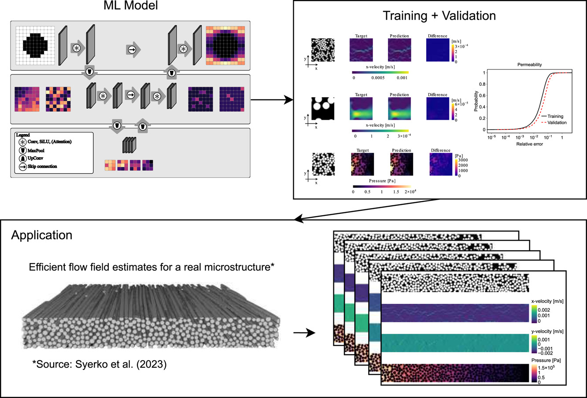
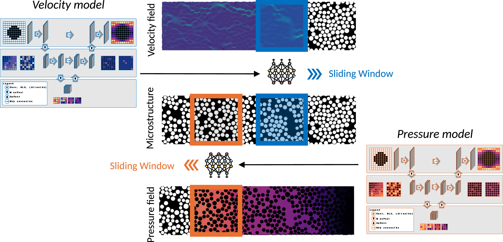

[](LICENSE.md)
[](https://github.com/camp-lab-tud/arbitrary-microstructure-flow/pulls)

[](https://github.com/camp-lab-tud/arbitrary-microstructure-flow)


[](https://doi.org/10.1016/j.compositesa.2025.109337)
[](https://doi.org/10.5281/zenodo.16940478)
[](https://doi.org/10.5281/zenodo.17306446)


# Predicting flow in arbitrary fibrous microstructures

## 📖 Overview
This repository contains the source code for the ML model and sliding-window technique described in our paper: 

[Jimmy Gaspard Jean](https://camp-lab.org/members/jimmy-jean.html),
[Guillaume Broggi](https://camp-lab.org/members/guillaume-broggi.html),
[Baris Caglar](https://camp-lab.org/members/baris-caglar.html) (2026).<br>
[**An image-based deep learning framework for flow field prediction in arbitrary-sized fibrous microstructures**](https://doi.org/10.1016/j.compositesa.2025.109337).<br>
Composites Part A: Applied Science and Manufacturing, Volume 200, 109337, ISSN 1359-835X


### BibTeX
If you use the code, please cite us:
```
@article{JEAN2026109337,
title = {An image-based deep learning framework for flow field prediction in arbitrary-sized fibrous microstructures},
journal = {Composites Part A: Applied Science and Manufacturing},
volume = {200},
pages = {109337},
year = {2026},
issn = {1359-835X},
doi = {https://doi.org/10.1016/j.compositesa.2025.109337},
url = {https://www.sciencedirect.com/science/article/pii/S1359835X25006311},
author = {Jimmy Gaspard Jean and Guillaume Broggi and Baris Caglar}
}
```

### Abstract


Numerical simulations are commonly used to predict resin flow in fibrous reinforcements but exhibit a trade-off between accuracy and computational cost. As an alternative, machine learning (ML) based models pose as a potential tool to accelerate or replace such costly simulations. This work proposes an open-source image-based deep learning framework to estimate the permeability of unidirectional microstructures in arbitrarily sized domains. This presents a scalable step towards estimating the permeability of large meso-domains. First, we present two robust and accurate surrogate models capable of predicting microstructure velocity and pressure fields with varying physical dimensions, fiber diameter, and volume fraction. These predictions achieve 5% error on the training set and 8% error on unseen microstructures. Secondly, based on those predicted flow fields, we infer the permeability of the microstructures with respectively 4% and 6% deviation for the training and validation sets. Third, opposed to previous works limited to microstructures with a fixed aspect ratio, we propose a so-called *sliding window* procedure, based on physics-based principles to predict the resin velocity and pressure field in microstructures with different aspect ratios. The method is validated against high-fidelity numerical simulations, and its predictive performance and computational efficiency are confirmed with μ-CT scans of real microstructures. Finally, the presented code and surrogate model are open-sourced to promote further exploration by the scientific community.


## ⬇️ Getting Started
> [!NOTE]
> This codebase was developed and tested on [**Ubuntu 22.04.5 LTS**](https://releases.ubuntu.com/jammy/).

Open the terminal of your computer. Change the current working directory to the location where you want to download the code. Then, run
```
git clone https://github.com/camp-lab-tud/arbitrary-microstructure-flow
```
```
cd arbitrary-microstructure-flow/
```
## ⚙️ Setup


Assuming that [Python 3.10.12](https://www.python.org/downloads/release/python-31012/) is installed on your computer, create a virtual environment in the main folder by running:
```
python3 -m venv ${ENV}
```
`${ENV}` (e.g., `.venv`) is the environment's name.

Activate the created `.venv` environment by running (on Linux):
```
source .venv/bin/activate
```

Install the required dependencies:
```
pip install -r requirements.txt
```


## 🚀 Inference
For inference on the validation split of the [dataset](https://doi.org/10.5281/zenodo.16940478), one can run the following script. It will perform velocity or pressure field prediction, depending on the ML model provided. 
```
python eval.py --root-dir ${ROOT-DIR} --split 'valid' --directory-or-url ${DIRECTORY_OR_URL}
```
`${ROOT-DIR}` refers to the dataset directory. If the directory does not exist, the dataset will be automatically [downloaded](https://zenodo.org/records/16940478/files/dataset.zip?download=1) and extracted to `${ROOT-DIR}`. `${DIRECTORY_OR_URL}` is either 

- the URL to one of the released [pre-trained model weights](https://doi.org/10.5281/zenodo.17306446), or
- the path to a local directory with the trained model files.

For instance,
```
python eval.py --root-dir 'data/dataset' --split 'valid' --directory-or-url 'https://zenodo.org/records/17306446/files/velocity_model_base.zip?download=1' 
```

## 🪟 Sliding Window


The code implementation of the *sliding window* procedure (for making inference on rectangular microstructures) is available in the [src/apps.py](src/apps.py) file.

Moreover, we provide in [scripts/eval_micrograph.py](scripts/eval_micrograph.py) an example of making predictions on the [micrograph data](https://doi.org/10.5281/zenodo.6611926) from the [virtual permeability benchmark](https://doi.org/10.1016/j.compositesa.2022.107397) by Syerko et al. (2023).
```
python -m scripts.eval_micrograph --micrograph-dir '${MICROGRAPH_DIR}' --velocity-model ${VELOCITY_MODEL} --pressure-model ${PRESSURE_MODEL}
```
where `${MICROGRAPH_DIR}` is the directory containing the micrograph data. The data can be accessed from the [correspoding repository](https://doi.org/10.5281/zenodo.6611926). `${VELOCITY_MODEL}` and `${PRESSURE_MODEL}` are URLs to [pre-trained](https://doi.org/10.5281/zenodo.17306446) velocity and pressure models (e.g., [https://zenodo.org/records/17306446/files/velocity_model_base.zip?download=1](https://zenodo.org/records/17306446/files/velocity_model_base.zip?download=1) and [https://zenodo.org/records/17306446/files/pressure_model_base.zip?download=1](https://zenodo.org/records/17306446/files/pressure_model_base.zip?download=1)). Alternatively, the local path to the downloaded and extracted folders can be passed.


## 💻 Training from scratch
To train from scratch, run:

(for the velocity field)
```
python train.py --root-dir ${ROOT-DIR} --predictor-type 'velocity' --in-channels 1 --out-channels 2
```
(for the pressure field)
```
python train.py --root-dir ${ROOT-DIR} --predictor-type 'pressure' --in-channels 2 --out-channels 1 --distance-transform ''
```
`${ROOT-DIR}` refers to a local directory containing this [dataset](https://doi.org/10.5281/zenodo.16940478).

## Questions
For any question related to the code, feel free to contact [Jimmy G. Jean](https://github.com/jimmygjean) via email [[j.g.jean@tudelft.nl](mailto:j.g.jean@tudelft.nl)] or [LinkedIn](https://www.linkedin.com/in/jimmy-g-jean/).