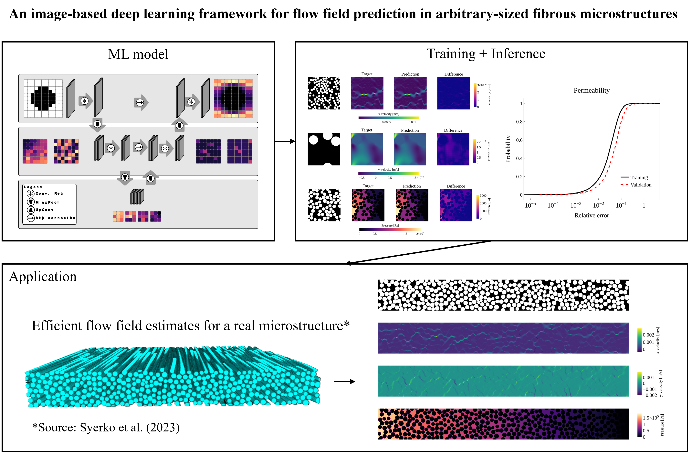

## Overview
This repository contains the source code of the ML model described in the paper `An image-based deep learning framework for flow field prediction in arbitrary-sized fibrous microstructures`.

Feel free to use the code, but please cite the paper.

## Setup

Assuming that Python 3.10 is already installed on your computer, create a virtual environment in the main folder by running:

    python3.10 -m venv ${ENV}
`${ENV}` (e.g., `.venv`) is the environment's name.

Activate the environment by running (on Linux):

    source .venv/bin/activate

Install the required dependencies:

    pip install -r requirements.txt

## Training
To train, run:

(for the velocity field)

    python train.py --root-dir ${ROOT-DIR} --predictor-type 'velocity' --in-channels 1 --out-channels 2

(for the pressure field)

    python train.py --root-dir ${ROOT-DIR} --predictor-type 'pressure' --in-channels 2 --out-channels 1 --distance-transform ''

`${ROOT-DIR}` refers to the dataset directory.

## Inference
For inference on the validation set, run

    python eval.py --folder ${FOLDER} --split 'valid'
in which `${FOLDER}` refers to the folder containing the trained model weights.
